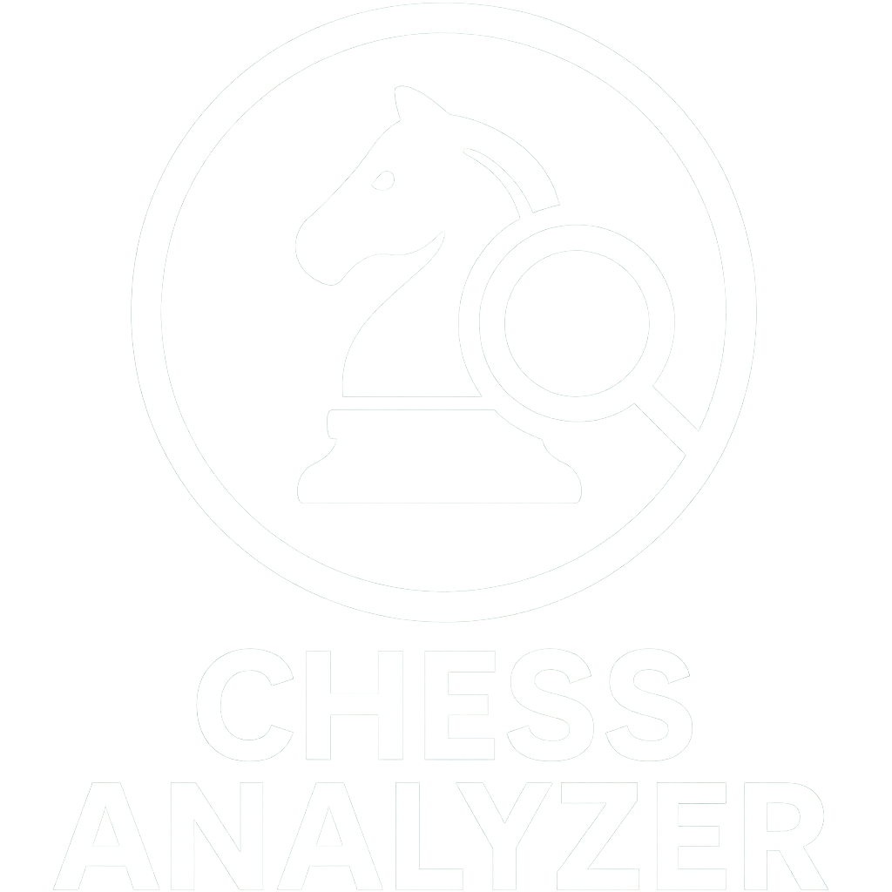

<div align="center">
  
  
  <h2><b>Chess Analyzer</b></h2>

  <p><i>An intelligent web-based chess analysis platform</i></p>

  <p align="center">
    <a href="https://chess-app.kkv9.ovh/">
      
    </a>
    <a href="https://github.com/KKV9/chess-analyzer">
      
    </a>
  </p>

  <p align="center">
    <a href="https://aistudio.google.com/">
      
    </a>
    <a href="https://www.chartjs.org/">
      
    </a>
    <a href="https://aws.amazon.com/">
      
    </a>
  </p>
</div>

---

An intelligent web-based application that analyzes thousands of chess games to extract insights, visualize trends, and assist players in improving their strategic understanding. Developed as part of the **COMP7039 – Agile Processes** module (Autumn 2025).

**Live Demo**: [https://chess-app.kkv9.ovh/](https://chess-app.kkv9.ovh/)  
**Sprint Progress**: 3/3 Sprints Completed  
**Repository**: [https://github.com/KKV9/chess-analyzer](https://github.com/KKV9/chess-analyzer)

## 📋 Table of Contents
- [Project Overview](#-project-overview)
- [Features](#-features)
- [Architecture](#%EF%B8%8F-architecture)
- [Technology Stack](#%EF%B8%8F-technology-stack)
- [Agile Development](#-agile-development)
- [Installation](#-installation)
- [Usage Guide](#-usage-guide)
- [API Documentation](#-api-documentation)
- [Team](#-team)

## 🎯 Project Overview

Chess Analyzer is a web-based application that takes large collections of chess games and turns them into useful feedback for players. It works by analyzing performance, spotting trends in play, and giving feedback on how players approach different situations or openings. The goal is to help users understand their play more clearly through accurate data rather than guesswork, allowing them to hone their skills.

This project demonstrates Agile development practices using the **Scrum framework**, with work divided into three focused sprints:
1. **Data Input & Validation** (Sprint 1)
2. **Data Visualization** (Sprint 2) 
3. **Knowledge Extraction with AI** (Sprint 3)

### Project Objectives
- Import and validate chess game datasets (CSV format)
- Visualize game statistics through interactive charts
- Generate AI-powered strategic insights using Google Generative AI
- Deploy a production-ready application with CI/CD
- Demonstrate Agile/Scrum methodologies in practice

## ✨ Features

### Core Functionality

| Feature | Status | Description |
|---------|---------|-------------|
| **CSV File Upload** | ✅ Complete | Upload your own chess games (max 2MB) |
| **Data Validation** | ✅ Complete | Validate chess CSV datasets for integrity and format |
| **Win Rate Analysis** | ✅ Complete | Interactive charts showing black vs white performance |
| **AI Player Analysis** | ✅ Complete | Strategic profiles using Google's Generative AI |
| **Animated Chess Demos** | ✅ Complete | Interactive Opera Game with move animations |
| **Responsive Design** | ✅ Complete | Mobile-friendly interface with dark theme |

### Sprint 1: Data Input (22/09/2025 - 29/09/2025)
**Scrum Master**: Cillian Houlihan  
**Velocity**: 25/25 story points

- ✅ CSV file upload system with 2MB limit
- ✅ Python validation script (validate.py)
- ✅ Data integrity checking (missing values, invalid format)
- ✅ Sample size reduction (200,000 → 5,000 games)
- ✅ Express.js backend with Multer file handling
- ✅ GitHub repository setup and team onboarding

### Sprint 2: Data Visualization (06/10/2025 - 20/10/2025)
**Scrum Master**: Daniel Sheehan  
**Velocity**: 36/36 story points

- ✅ Win rate visualization with Chart.js
- ✅ Interactive bar charts (White/Black/Draws)
- ✅ Enhanced UI with CSS animations
- ✅ Animated chess board demo (Opera Game)
- ✅ CI/CD pipeline with GitHub Actions
- ✅ AWS EC2 deployment with zero-downtime
- ✅ Nginx reverse proxy configuration
- ✅ Let's Encrypt SSL certificates

### Sprint 3: Knowledge Extraction (03/11/2025 - 17/11/2025)
**Scrum Master**: Scott Wolohan  
**Status**: In Progress

- ✅ Google Generative AI (Gemini) integration
- ✅ Strategic player profile analysis
- ✅ Opening preference identification
- ✅ Personalized training recommendations
- ✅ Final report documentation
- ✅ Presentation preparation

## 🏗️ Architecture

```
┌─────────────────────────────────────────────────────┐
│                    User Browser                      │
│         (HTML/CSS/JavaScript + Chart.js)             │
└────────────────────┬─────────────────────────────────┘
                     │ HTTP/HTTPS Requests
                     ▼
┌─────────────────────────────────────────────────────┐
│              Nginx Reverse Proxy                     │
│          (SSL, Port 443→3000, Caching)               │
└────────────────────┬─────────────────────────────────┘
                     │
                     ▼
┌─────────────────────────────────────────────────────┐
│           Express.js Server (Node.js)                │
│  Routes: /upload-csv, /run-validation,               │
│          /run-black-white, /run-strategy             │
└────────────┬─────────────────────┬────────────────────┘
             │                     │
             │ Multer Upload       │ Child Process Exec
             ▼                     ▼
    ┌────────────────┐    ┌──────────────────────┐
    │  data/data.csv │    │  Python Scripts      │
    │   (5000 games) │    │  - validate.py       │
    └────────────────┘    │  - wins.py           │
                          │  - strat.py          │
                          └──────────┬───────────┘
                                     │
                                     ▼
                          ┌──────────────────────┐
                          │ Google Generative AI │
                          │    (Gemini API)      │
                          └──────────────────────┘
```

## 🛠️ Technology Stack

| Layer | Technologies | Purpose |
|-------|---------------|---------|
| **Frontend** | HTML5, CSS3, JavaScript, Bootstrap 5, Chart.js | User interface and data visualization |
| **Backend** | Node.js 14+, Express.js 4.18 | Web server and API routing |
| **File Handling** | Multer | CSV file uploads (max 2MB) |
| **AI/ML** | Google Generative AI (Gemini), Python 3.10 | Strategic analysis and insights |
| **Data Processing** | Python CSV module, JSON | Chess game analysis and statistics |
| **DevOps** | GitHub Actions, PM2, Nginx | CI/CD and process management |
| **Hosting** | AWS EC2 (t3.micro, eu-north-1), Cloudflare DNS | Production deployment |
| **Security** | Let's Encrypt SSL, SSH keys, .env variables | HTTPS encryption and secrets management |

## 📂 Project Structure

```
chess-analyzer/
├── .github/
│   └── workflows/
│       └── deploy.yml          # CI/CD pipeline configuration
├── public/                     # Frontend assets
│   ├── css/
│   │   └── styles.css          # Main stylesheet with animations
│   ├── js/                     # JavaScript modules
│   │   ├── index.js            # Chess board animations
│   │   ├── strategy.js         # AI analysis interface
│   │   ├── validator.js        # Data validation UI
│   │   └── visualiser.js       # Chart.js visualizations
│   ├── images/
│   │   ├── logo.png            # Application logo
│   │   ├── favicon_white.png
│   │   └── favicon_black.png
│   ├── index.html              # Homepage with chess demo
│   ├── validator.html          # CSV validation page
│   ├── visualiser.html         # Win rate charts page
│   └── strategy.html           # AI analysis page
├── scripts/                    # Python analysis scripts
│   ├── validate.py             # CSV validation (Sprint 1)
│   ├── wins.py                 # Win rate analysis (Sprint 2)
│   ├── strat.py                # AI player analysis (Sprint 3)
│   └── requirements.txt        # Python dependencies
├── data/
│   └── data.csv                # Chess games dataset (user uploads)
├── venv/                       # Python virtual environment (gitignored)
├── logs/                       # PM2 application logs
├── server.js                   # Express server with API endpoints
├── ecosystem.config.js         # PM2 production configuration
├── package.json                # Node.js dependencies
├── .env                        # Environment variables (gitignored)
├── .env.example                # Environment template
└── README.md                   # This file
```

## 🏃 Agile Development

### Sprint Timeline

| Sprint | Duration | Focus | Scrum Master | Velocity | Status |
|--------|-----------|--------|--------------|----------|---------|
| **Sprint 1** | 22 Sep – 29 Sep (7 days) | Data Input & Validation | Cillian Houlihan | 25/25 points | ✅ Complete |
| **Sprint 2** | 6 Oct – 20 Oct (14 days) | Visualization & DevOps | Daniel Sheehan | 36/36 points | ✅ Complete |
| **Sprint 3** | 3 Nov – 17 Nov (14 days) | AI Integration & Docs | Scott Wolohan | 18+ points | 🔄 In Progress |

### Team Roles

| Member | Role | Contributions |
|---------|------|---------------|
| **Cillian Houlihan** | Sprint 1 Scrum Master | Data validation, CSV sampling, project foundation |
| **Daniel Sheehan** | Sprint 2 Scrum Master | Visualization, UI/UX, GitHub repo management |
| **Scott Wolohan** | Sprint 3 Scrum Master | AI integration, research, strategic analysis |
| **Ciarán O'Brien** | DevOps Lead | AWS deployment, CI/CD, Nginx config, infrastructure |

### Agile Practices
- **Project Management**: Jira (Product Backlog, Sprint Backlogs, Burndown Charts)
- **Version Control**: GitHub with feature branches and pull requests
- **Communication**: Discord (daily standups), Weekly lab sessions (in-person reviews)
- **Ceremonies**: Sprint Planning, Daily Standups, Sprint Reviews, Retrospectives
- **Metrics**: Story points, velocity tracking, burndown charts

### Key Achievements
- 📈 Perfect velocity in Sprint 2 (36/36 points, 100% completion)
- 🚀 Automated CI/CD deployment (Oct 7, 2025 - commit 87699f5)
- 🎨 Professional UI with animations and responsive design
- 🤖 AI-powered player analysis operational
- 📊 Interactive data visualizations with Chart.js

## 💻 Installation

### Prerequisites
- **Node.js** (v14 or higher)
- **Python** (v3.10 recommended)
- **npm** (v6 or higher)
- **Google Generative AI API Key** ([Get one free](https://aistudio.google.com/))

### Local Development Setup

1. **Clone the Repository**
```bash
git clone https://github.com/KKV9/chess-analyzer.git
cd chess-analyzer
```

2. **Install Node.js Dependencies**
```bash
npm install
```

3. **Setup Python Virtual Environment**
```bash
# Create virtual environment
python3 -m venv venv

# Activate virtual environment
source venv/bin/activate  # Linux/Mac
# venv\Scripts\activate   # Windows

# Install Python dependencies
pip install --upgrade pip
pip install -r scripts/requirements.txt

# Deactivate when done
deactivate
```

4. **Configure Environment Variables**
```bash
# Copy template
cp .env.example .env

# Edit .env with your settings
nano .env
```

**.env file:**
```env
# Server Configuration
PORT=3000

# Google Generative AI API Key
GENAI_KEY=your_google_genai_api_key_here

# Node Environment
NODE_ENV=development
```

5. **Start the Application**
```bash
# Development mode
node server.js

# Or with PM2 (production-like)
npm install -g pm2
pm2 start ecosystem.config.js
pm2 logs chess-analyzer
```

6. **Access the Application**
```
http://localhost:3000
```

### Deployment (Production)

The application automatically deploys to AWS EC2 when code is pushed to the `master` branch via GitHub Actions.

**Manual Deployment:**
```bash
# SSH to EC2
ssh ubuntu@your-ec2-ip

# Navigate to project
cd /var/www/chess-analyzer

# Pull latest changes
git pull origin master

# Install dependencies
npm install --omit=dev

# Setup Python venv if needed
python3 -m venv venv
source venv/bin/activate
pip install -r scripts/requirements.txt
deactivate

# Reload application
pm2 reload ecosystem.config.js --update-env
```

## 📖 Usage Guide

### 1. Upload Your Chess Games
1. Navigate to the **Validator** page
2. Click "Choose File" and select your CSV file (max 2MB)
3. Click "Upload File"
4. Once uploaded, click "Run Validation" to verify data integrity

**CSV Format Requirements:**
- Must contain columns: `White`, `Black`, `Result`
- Result format: `1-0` (white wins), `0-1` (black wins), `1/2-1/2` (draw)
- Maximum file size: 2MB

### 2. Visualize Win Rates
1. Go to **Visualizer** page
2. Click "Graph Wins" to analyze uploaded data
3. View interactive Chart.js visualizations showing:
   - White win percentage
   - Black win percentage  
   - Draw percentage
   - Total games analyzed

### 3. Get AI Player Analysis
1. Access **Strategy Analysis** page
2. Enter a player name exactly as it appears in your CSV
3. Click "Analyze Player"
4. Wait 10-30 seconds for AI analysis
5. Review strategic profile including:
   - Playing style (Aggressive/Positional/Tactical/Defensive)
   - Strengths and weaknesses
   - Opening preferences
   - Middlegame skills assessment
   - Personalized training recommendations

### 4. Watch Chess Demonstrations
- **Homepage** features an animated Opera Game
- Watch pieces move, captures, and special effects
- See check/checkmate indicators
- Confetti animation on game completion

## 🔌 API Documentation

### Upload CSV File
```http
POST /upload-csv
Content-Type: multipart/form-data

Body:
  csvFile: [file] (max 2MB)

Response:
{
  "success": true,
  "message": "File uploaded successfully",
  "filename": "data.csv",
  "size": 1234567
}
```

### Validate CSV Data
```http
GET /run-validation

Response: Plain Text
✅ Found file: data/data.csv
✅ Header columns: ['White', 'Black', 'Result', ...]
✅ First data row: [...]
🎉 CSV validation completed successfully!
```

### Get Win Rate Statistics
```http
GET /run-black-white

Response: JSON
{
  "success": true,
  "total_games": 5000,
  "white_wins": 1876,
  "black_wins": 1634,
  "draws": 1490,
  "white_percentage": 37.52,
  "black_percentage": 32.68,
  "draw_percentage": 29.80
}
```

### Analyze Player Strategy
```http
GET /run-strategy?player=PlayerName

Response: Formatted Text
🔍 Searching for games by: PlayerName
✅ Found database: data/data.csv
✅ Found 42 game(s) for PlayerName
🧠 Generating AI analysis... (this may take 10-30 seconds)

============================================================
PLAYER PROFILE:
- Style: Aggressive
- Strengths: [AI-generated insights]
...
============================================================
```

## 🧪 Testing and Verification

### Validation Testing
The `validate.py` script ensures:
- CSV file exists and is readable
- Required columns present (`White`, `Black`, `Result`)
- Headers are valid
- Data rows contain values
- No empty or malformed entries

### Win Rate Testing
The `wins.py` script:
- Parses all game results
- Counts wins for white, black, and draws
- Calculates accurate percentages
- Returns structured JSON data

### Deployment Verification
- **PM2 Monitoring**: `pm2 monit` shows real-time CPU/memory usage
- **Application Logs**: `pm2 logs chess-analyzer` for debugging
- **Health Checks**: Manual testing after each deployment
- **CI/CD Testing**: GitHub Actions verifies deployment success

## 🔒 Security

- ✅ HTTPS encryption via Let's Encrypt
- ✅ SSH keys for server access (admin + GitHub Actions)
- ✅ Environment variables in `.env` (gitignored)
- ✅ Input sanitization on all API endpoints
- ✅ File upload restrictions (2MB max, CSV only)
- ✅ API rate limiting (60 second timeout)
- ✅ GitHub Secrets for CI/CD credentials

## 🐛 Troubleshooting

### Common Issues

**"File size exceeds 2MB limit"**
- Reduce your CSV file size
- Remove unnecessary columns
- Sample fewer games

**"Missing GENAI_KEY environment variable"**
```bash
# Verify .env file exists
cat .env | grep GENAI_KEY

# Restart server after adding key
pm2 restart chess-analyzer
```

**"Player not found in database"**
- Check spelling matches CSV exactly
- Player names are case-insensitive
- Ensure player has games in uploaded file

**Python Script Errors**
```bash
# Activate virtual environment
source venv/bin/activate

# Reinstall dependencies
pip install -r scripts/requirements.txt

# Test script manually
python3 scripts/validate.py
```

**Deployment Issues**
```bash
# Check application status
pm2 status chess-analyzer

# View logs
pm2 logs chess-analyzer --lines 50

# Restart application
pm2 restart chess-analyzer
```

## 📚 Documentation

- **[Interim Report](docs/interim-report.pdf)** - Submitted 02 November 2025
- **Final Report** - Due 01 December 2025
- **Presentation Slides** - Scheduled 24 November 2025

## 🎓 Academic Context

**Module**: COMP7039 – Agile Processes  
**Institution**: Munster Technological University  
**Semester**: Autumn 2025  
**Lecturer/Product Owner**: Dr Alex Vakaloudis  

This project demonstrates:
- Scrum framework implementation
- Agile software development practices
- Sprint planning and execution
- Continuous integration and delivery
- Team collaboration and communication
- Iterative development and feedback loops

## 📊 Project Status

| Component | Status | Notes |
|-----------|---------|-------|
| Data Upload | ✅ Production | Multer integration, 2MB limit |
| Data Validation | ✅ Production | Handles 5000+ game datasets |
| Visualization | ✅ Production | Interactive Chart.js graphs |
| AI Analysis | ✅ Production | Google Gemini integration |
| Deployment | ✅ Production | AWS EC2 with CI/CD |
| Documentation | ✅ Done | Interim report complete, final report complete |

## 👥 Team

| Member | Role | GitHub | Contributions |
|---------|------|--------|---------------|
| **Cillian Houlihan** | Sprint 1 Lead | [@houlihan999](https://github.com/houlihan999) | Data validation, CSV processing |
| **Daniel Sheehan** | Sprint 2 Lead | [@Daniel-Sheehan-Projects](https://github.com/Daniel-Sheehan-Projects) | UI/UX, visualization, repo management |
| **Scott Wolohan** | Sprint 3 Lead | [@ScottW23](https://github.com/ScottW23) | AI integration, research, documentation |
| **Ciarán O'Brien** | DevOps Lead | [@KKV9](https://github.com/KKV9) | Infrastructure, CI/CD, deployment |

## 📄 License

This project is developed for educational purposes as part of COMP7039 – Agile Processes.  
Not intended for commercial use.

All chess data used for analysis is from publicly available sources and used for educational demonstration only.

---

<div align="center">
  <p><b>Chess Analyzer</b> - Developed with ♟️ using Agile/Scrum</p>
  <p>© 2025 - Munster Technological University</p>
</div>
